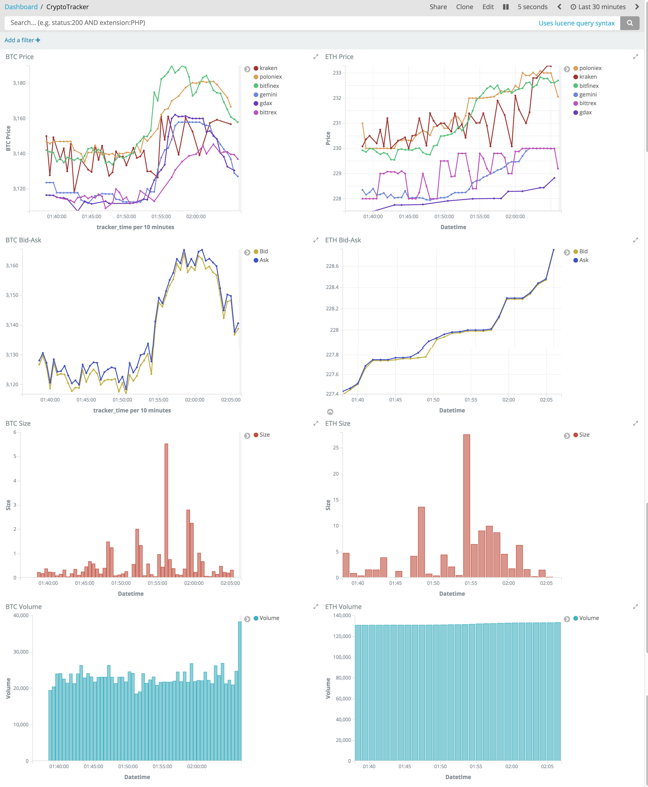
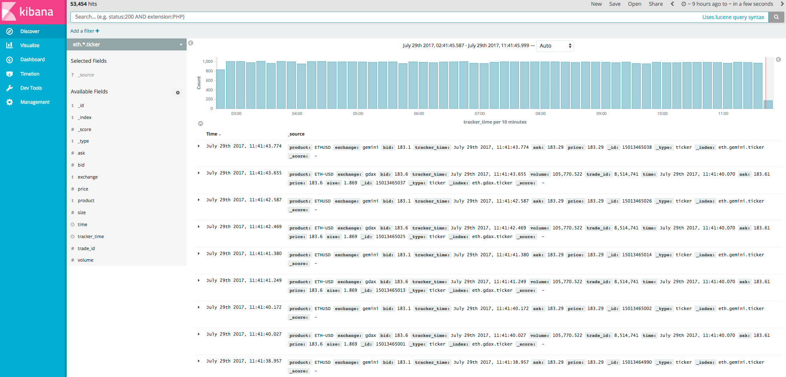

[](https://travis-ci.org/EthVentures/CryptoTracker)
# CryptoTracker
CryptoTracker makes it easy for you to collect, store, analyze, visualize, and monitor cryptocurrency data. You can use this open source project to track Price, Bid/Ask Spreads, Size, and Volume, test hypotheses about markets, build machine learning models to predict price movements, understand volatility, arbitrage / algorithmically trade, and more. CryptoTracker enables high-quality cryptocurrency R&D across all major exchanges.

Pull Requests welcome and encouraged.

# Supported Exchanges
 1. [BitFinex](https://bitfinex.com/)
 2. [BitTrex](https://bittrex.com/)
 3. [Bitmex](https://bitmex.com/)
 4. [GDAX](https://gdax.com)
 5. [Gemini](https://gemini.com)
 6. [Kraken](https://kraken.com)
 7. [OKCoin](https://www.okcoin.com/)
 8. [Poloniex](https://poloniex.com)
 9. [BitMex](https://www.bitmex.com)

# Screenshots





# Requirements
1. [Docker](https://www.docker.com/community-edition)

# Optional Configuration
1. Adjust timer settings in settings.py
2. Verbosity of logs can be configured in default.env

# Running
```js
docker-compose build && docker-compose up
```
This command will build and launch 3 docker containers: Elasticsearch, Kibana, and python2.7. Elasticsearch is used as our datastore, Kibana is used to setup visualizations and dashboards, and python2.7 operates our application. Elasticsearch and Kibana are customizable via .yml and Dockerfiles (included), and python2.7 is automatically configured for you to run after an initial setup delay. Once the system loads, which could take a few minutes, you should be able to navigate to Kibana to see all of the data that's flowing from the exchanges into Elasticsearch.

http://localhost:5601/

If this is the first time running Kibana, it may take an additional minute to load as the container runs it's initial optimization script. You will also need to add the following index patterns, with Time-field name being set to tracker_time:

```js
eth.*.ticker
btc.*.ticker
*.*.ticker
```

 A json file containing saved objects and dashboards is provided under /resources. This file can be imported from Kibana's UI by navigating to Management->Saved Objects->Import. Auto-Refresh interval on all dashboard has been preconfigured for 5 seconds.

# Production Settings
 On a live system, vm_map_max_count should be permanently set in /etc/sysctl.conf:
```js
 $ grep vm.max_map_count /etc/sysctl.conf
 vm.max_map_count=262144
```

# Additional Resources
In a development environment, a kibana configuration script is provided at resources/configure-kibana.sh to help automatically set default indexes, set refresh timers, and import all the graphs/dashboards. This configuration script is not recommended in production yet due to occasional issues with the discover tab not responding after import.
# Provided By

[](https://ethventures.io)
